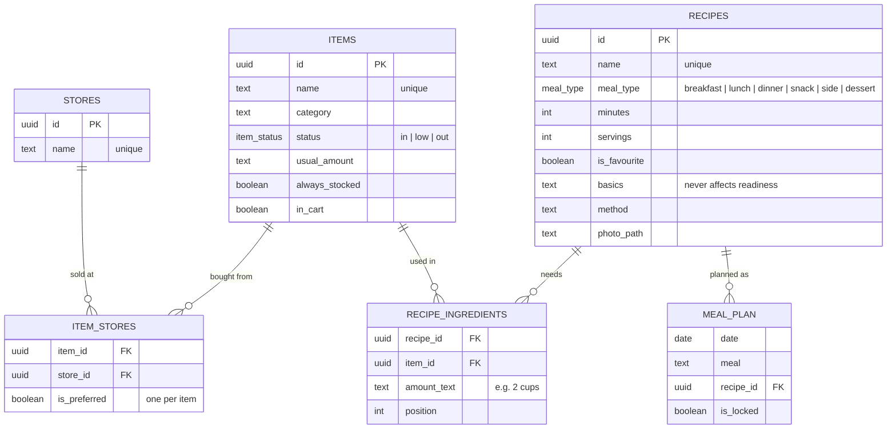

# Pantry App — Build Plan

*Copied from the live Build Plan doc on 2026-09-30. The live doc is where progress is ticked off; this copy is a snapshot kept with the code.*

One app, built in three phases: pantry and shopping first, then recipes with photos, then a weekly menu with a generator. Each phase is usable on its own before the next starts.

## Decisions locked in

- **Status:** every item is In, Low or Out. One tap changes it.
- **Stores:** an item can come from several stores, with one marked Preferred. Items with no store show under "Any store."
- **Usual amount:** one per item (e.g. "1 bag"), shown on the shopping list.
- **Recipes link to pantry items, never free text.** New ingredients are picked from the pantry or created there.
- **No exact quantity tracking.** In / Low / Out answers "can I cook this?" Salt, oil and water are assumed in stock.
- **Photos:** one optional photo per recipe, your own. Letter placeholder when none.
- **Menu generator:** rule-based from your own recipes first; AI suggestions come later.

## Stack and how we work

- **Front end:** React, installed on your phone's home screen as a web app (no app store).
- **Back end:** Supabase — Postgres database, file storage for photos, and sync between devices.
- **Hosting:** Vercel.
- **How we work:** Claude writes the code one step at a time and explains each piece; you run it, follow along, and ask questions before moving on. You make every commit.
- **Reference:** the wireframes in [`docs/wireframes/`](wireframes/) show every planned screen.

## Phase 1 — Pantry & shopping (v1)

Screens: Kitchen, Shopping list, Add / edit item, Stores. Done when the household uses it instead of a note on the fridge.

- [x] **Step 1 — Data model.** Items, Stores and ItemStores tables, with field names and types.
- [x] **Step 2 — Static Kitchen list.** Set up a React project and render items from a hard-coded array, grouped by category.
- [x] **Step 3 — Tap to change status.** Add state so In / Low / Out updates on tap. Add the filters (All / Low / Out).
- [x] **Step 4 — Database.** Connect Supabase; sign in; load and save items so changes persist and sync live.
- [x] **Step 5 — Stores.** Stores screen, multi-store picker with Preferred, and the Usual amount field on the item form.
- [x] **Step 6 — Shopping list.** Low and Out items grouped by store; tick off in the cart; Finish trip sets them back to In.
- [x] **Step 8 — Deploy.** Host it and add it to your phone's home screen.

Phase 1 is complete: the app is live on Vercel and on the home screen. Quick add and change password moved to Phase 1.1.

## Phase 1.1 — Small improvements

Quick wins on top of the live app, done in any order.

- [x] **Fix — Sign-in retry.** Requests that fail with "JWT issued at future" (a brief clock mismatch between Supabase's servers right after sign-in) are retried automatically, up to three times over about 3½ seconds.
- [x] **Store chips show everything at that store.** The All view still lists each item once under its preferred store; tapping a store chip shows every needed item you can buy there, with "also at" hints. The item form's other stores now say "☆ Make preferred".
- [x] **Hygiene category and In filter.** Hygiene added to the categories; the Kitchen filters are now All / In / Low / Out.
- [x] **Step 7a — Search.** A search box on the Kitchen screen narrows the list as you type (ignores case and accents) and works together with the All / In / Low / Out chips. No match offers "+ Add … as a new item" with the name filled in. Quick add (step 7) will build on the same box.
- [ ] **Step 7 — Quick add.** Type "out of eggs" to find the item and mark it Out (voice comes later).
- [ ] **Step 8b — Change password.** A small Account screen (next to Sign out) where each household member sets a new password, entered twice, so passwords set for others can be replaced and nobody needs the Supabase dashboard for it.
- [ ] **Step 8c — Fingerprint / Face ID sign-in (passkeys).** On the Account screen, "Add fingerprint sign-in" saves a passkey; the sign-in screen gets a "Sign in with fingerprint / Face ID" button. Uses Supabase's passkey sign-in (beta, experimental API). Do it after the custom domain is set up: a passkey is tied to the web address, and changing the domain later invalidates it. Needs the Passkeys switch and domain entered under Authentication → Passkeys in Supabase.
- [ ] **Step 8d — Categories screen.** Categories become their own table (like stores): add, rename, remove and reorder them in the app, and the Kitchen sections follow that order. Needs a migration that creates the table from the categories already in use and links each item to it.

## Phase 1.5 — Chat bot: Telegram and WhatsApp

Starts after v1 ships. One shared "brain" in n8n does the work; each chat app is a thin adapter in front of it. Done when "out of eggs" from either app shows up in the app.

- [ ] **Step C-1 — Contacts table.** Link each Telegram chat ID or WhatsApp number to a household member, with their preferred app. Unknown senders are ignored.
- [ ] **Step C-2 — Telegram adapter.** Telegram trigger in n8n; convert each message to one shape (app, sender, text); echo it back.
- [ ] **Step C-3 — Shared brain: log items.** A sub-workflow both adapters call. It reads and writes only through a few named database functions (set an item's status, get the shopping list), which the OpenClaw assistant reuses in Phase 3.5. Parse "out of eggs, low on rice", match each word to a pantry item, update Supabase, return "Done".
- [ ] **Step C-4 — No guessing.** When a word matches more than one item or none, ask back instead of guessing (an AI model can do the matching).
- [ ] **Step C-5 — Ask for lists.** "Costco list?" returns Low and Out items for that store with usual amounts.
- [ ] **Step C-6 — WhatsApp adapter.** Test with the Twilio sandbox, then move to Meta's WhatsApp Business setup with a dedicated number. No new logic: it calls the same brain.
- [ ] **Step C-7 — Weekly nudge.** Saturday-morning shopping summary, sent to each person on their preferred app (WhatsApp needs a Meta-approved template and may cost a little per message).

## Phase 2 — Recipes & photos (v2)

Screens: Recipes tab, Recipe form, Recipe detail. Done when you can open a recipe and see at a glance what you're missing. Started early (before finishing Phase 1.1) so there are real recipes to use.

**Decisions:** meal types are Breakfast, Lunch, Dinner, Snack, Side, Dessert. "Assumed basics" (salt, oil, water) is a short note on the recipe that never affects readiness. A pantry item created from the recipe form starts as In (switchable to Out). No "Add missing to shopping list" button: missing ingredients are Out items, which are already on the shopping list.

**2a — Recipe tables and form**

- [x] **Step 9 — Recipe tables.** `recipes` and `recipe_ingredients` (each ingredient is a pantry item, with an amount like "2 cups" as display text and its position in the list), with security rules and live sync. `save_recipe` saves a recipe and its whole ingredient list in one transaction. Items used in a recipe can't be deleted.
- [x] **Step 10 — Recipe form.** Name, meal type, minutes, servings, favourite, assumed basics and method. Ingredients are picked by searching the pantry, can be reordered, and a missing one can be added to the pantry on the spot. Recipes tab added to the bottom bar.

**2b — Readiness and recipe detail**

- [x] **Step 11 — Readiness.** Work out Ready / Low / Missing for each recipe from its ingredients' live status; sort Ready first; search plus ★ Favourites and Under 30 min filters.
- [x] **Step 12 — Recipe detail.** Ingredients with status, "Missing 2: already on your shopping list" (opens the list), assumed basics, method, and an Edit button.

**2c — Photos**

- [x] **Step 13 — Photos.** One photo per recipe: take or choose one on the recipe screen, shrunk on the phone (longest side 1280 px, JPEG up to ~250 KB), uploaded to a private Supabase Storage bucket (`recipe-photos`, household only) and linked by `photo_path`. Thumbnails in the list, a large photo on the recipe screen with Change / Remove, letter placeholder when empty. Deleting a recipe deletes its photo.

## Phase 3 — Weekly menu & generator (v3)

Screens: Weekly menu, Generate a week. Done when one button plans the week and fills the shopping list.

- [ ] **Step 14 — MealPlan table.** One row per date and meal (breakfast / lunch / dinner) pointing to a recipe, plus a locked flag.
- [ ] **Step 15 — Weekly menu screen.** Pick a recipe per day by hand; show readiness and thumbnails.
- [ ] **Step 16 — Generator.** Score each recipe (In +, Low −, Out −−, favourites +), apply the rules (no repeats, skip last week, long recipes on weekends), fill the chosen days.
- [ ] **Step 17 — Lock and re-roll.** Keep locked days; regenerate the rest.
- [ ] **Step 18 — Week to shopping list.** Collect Low and Out ingredients across the week, deduplicated, and add them in one tap.

## Phase 3.5 — OpenClaw kitchen assistant

Starts after Phase 3, so there are recipes and menus to reason over. A second chat interface on the same data: the n8n bot stays for quick, predictable logging; the OpenClaw assistant handles open-ended questions. Done when it can answer "what can I cook tonight without going to Costco?" correctly.

- [ ] **Step O-1 — Host.** Install OpenClaw on an always-on machine (spare laptop or small cloud server).
- [ ] **Step O-2 — Own channel.** Connect it to a separate Telegram bot (e.g. "Kitchen Assistant") so it never competes with the n8n bot.
- [ ] **Step O-3 — Least privilege.** Give it a key that can call only the pantry database functions, nothing else. No community skills without reading them first.
- [ ] **Step O-4 — Pantry skill, read-only.** Teach it the tables and functions; answer questions like "what's low?" and "what can I cook tonight?"
- [ ] **Step O-5 — Allow changes, with confirmation.** "Just got back from Costco with rice and toilet paper" → it proposes the updates and waits for a yes.
- [ ] **Step O-6 — Menu helper.** "Plan next week, I'm busy Wednesday" → a draft menu you approve before it's saved.
- [ ] **Step O-7 — Write-up.** A short comparison in the README: n8n bot vs OpenClaw agent on cost per message, reliability and what each is good at.

## Phase 4 — Later ideas (not scheduled)

- **AI menu suggestions:** new recipes from an AI model, imported by matching each ingredient to a pantry item.
- **Voice capture:** "we're out of rice" via a phone shortcut or chat bot.
- **Who changed what:** record which household member changed an item's status or ticked it in the cart, and show it ("Eggs marked Out by Bee, 2 h ago").
- **Multiple households (multi-tenancy):** today the app is one shared household, and every signed-in user sees everything. To offer it to other families, add a `households` table, tag every item and store with its household, and tighten the security rules so people only see their own household's rows.
- **Roles and permissions:** today every member can add, edit and delete anything. Optionally make some actions admin-only, such as deleting items, removing stores or adding members.
- **Barcode scan** to add items.
- **Reminders:** a weekly digest before shopping day, or a nudge when an always-stocked item goes Low.
- **Offline use:** see the list in the store with no signal.

## Data model

Arrows point from a table to the one it references. The two linking tables (`item_stores`, `recipe_ingredients`) are the same many-to-many pattern as a junction object in Salesforce. Phase 1 and Phase 2 tables exist today; `meal_plan` is planned.

Phase 1.5 adds one more table, **contacts** (person, app, chat ID or phone number, preferred app), which also records who changed an item's status.
