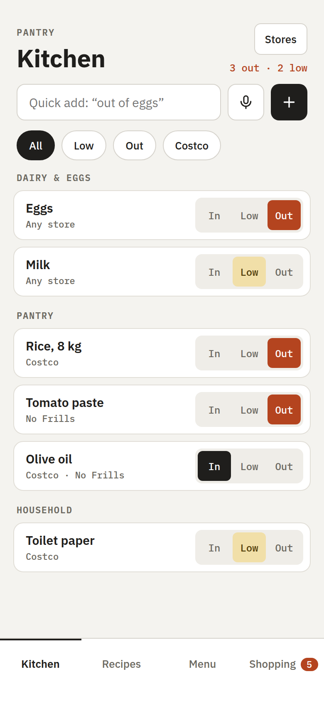
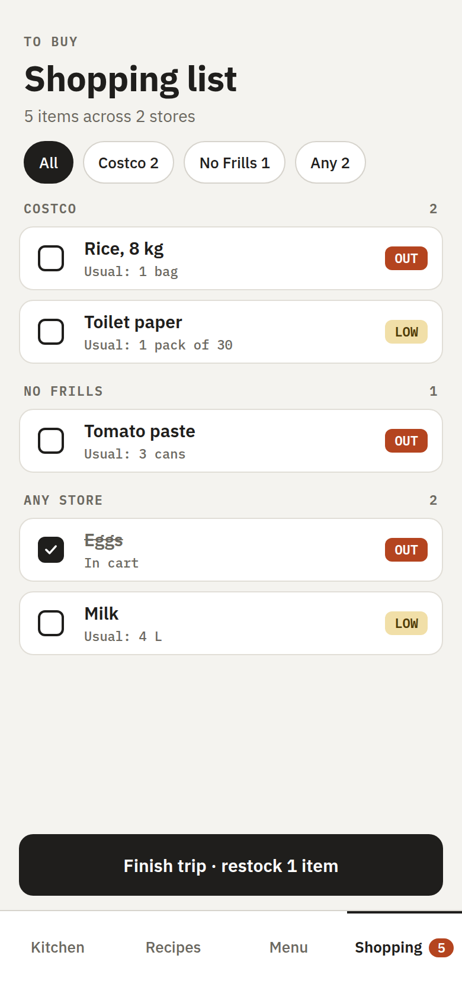
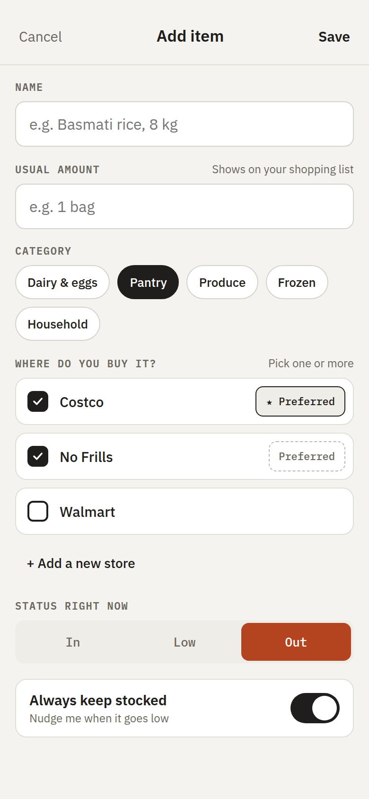
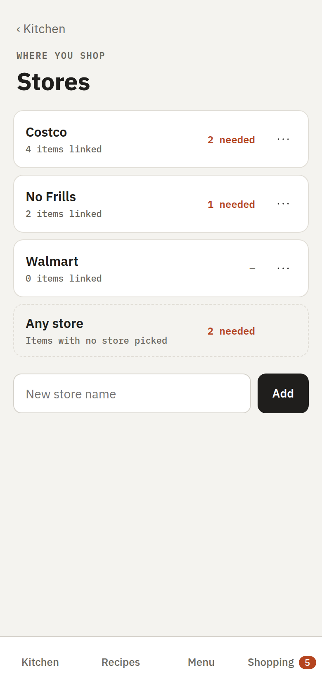
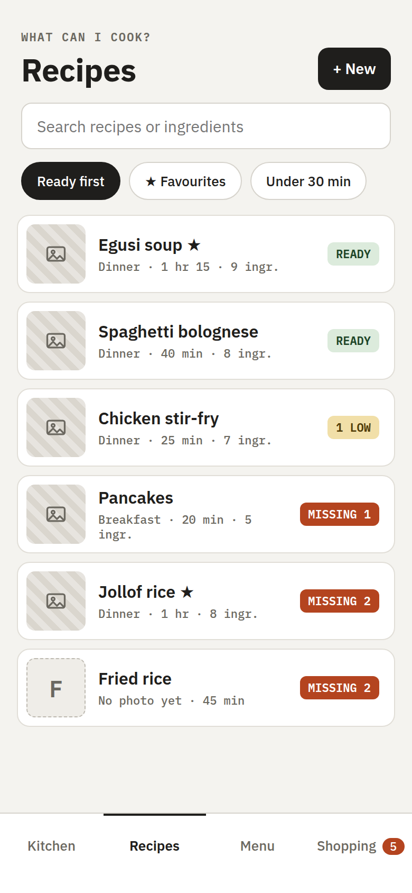
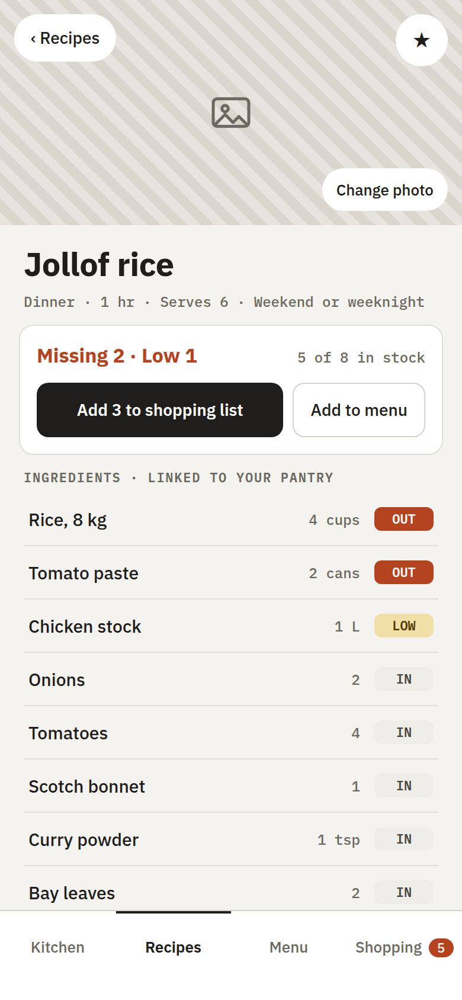
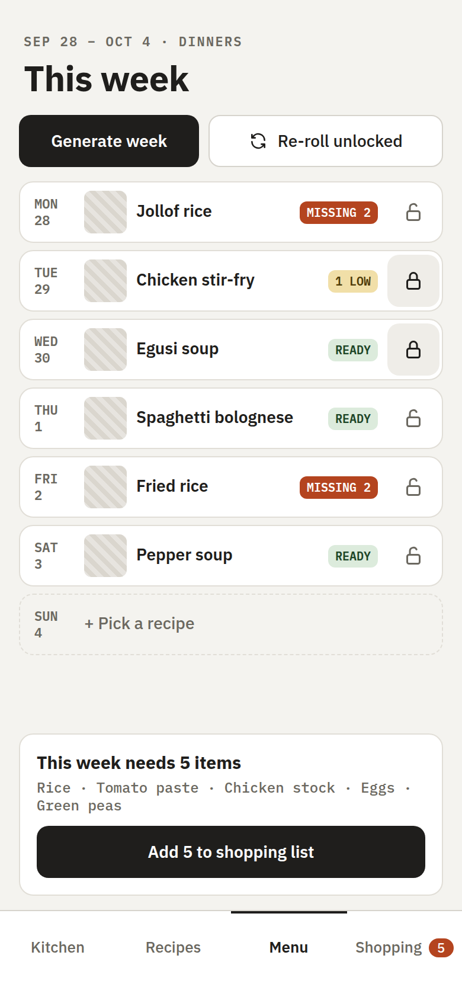
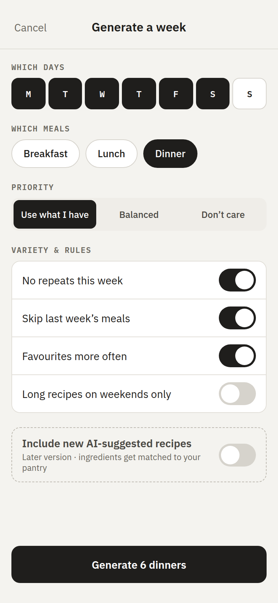

# Wireframes

The original screen designs, made before any code was written (September 2026). They're a design reference, not a spec: where the built app differs, the app wins.

## v1 — Pantry & shopping (built in Phase 1)

| Kitchen | Shopping list | Add / edit item | Stores |
| --- | --- | --- | --- |
|  |  |  |  |

## v2–v3 — Recipes & weekly menu (Phases 2 and 3, planned)

| Recipes | Recipe detail | Weekly menu | Generate a week |
| --- | --- | --- | --- |
|  |  |  |  |

## Where the built app differs so far

- **Tab bar:** Kitchen and Shopping only for now; Recipes and Menu tabs arrive with Phases 2 and 3.
- **Kitchen header:** a **+** button replaces the separate quick-add row; quick add (step 7) and the voice button are still to come. The Costco filter chip moved to the Shopping list's store chips.
- **Stores:** Rename and Remove are text buttons instead of a ⋯ menu.
- **Item form:** Save is a full-width button at the bottom rather than in the header, and editing an item adds a Delete button.
